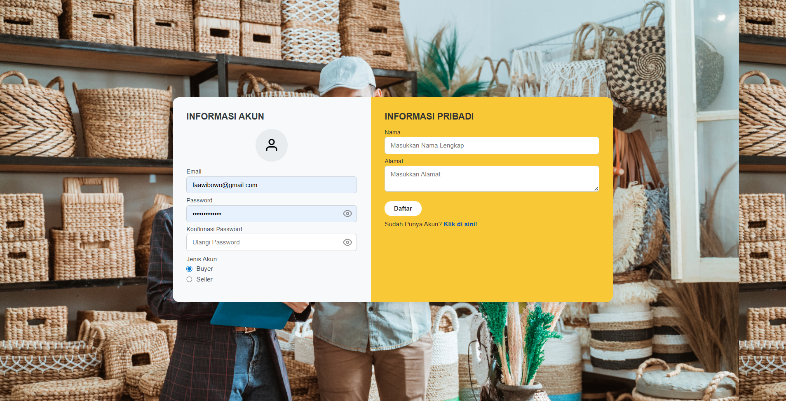
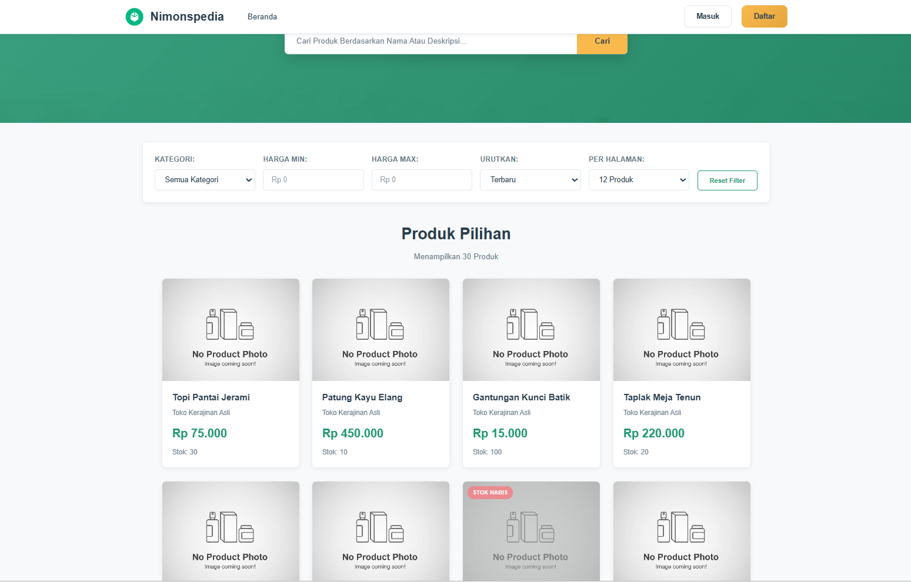
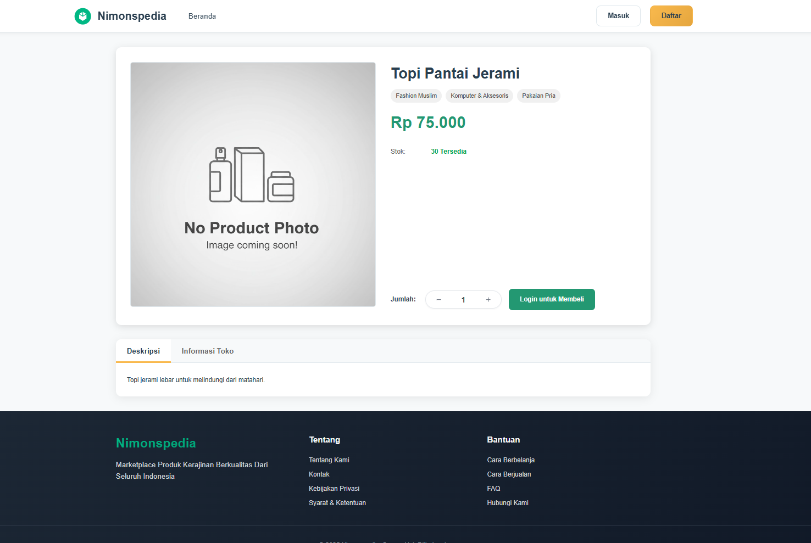
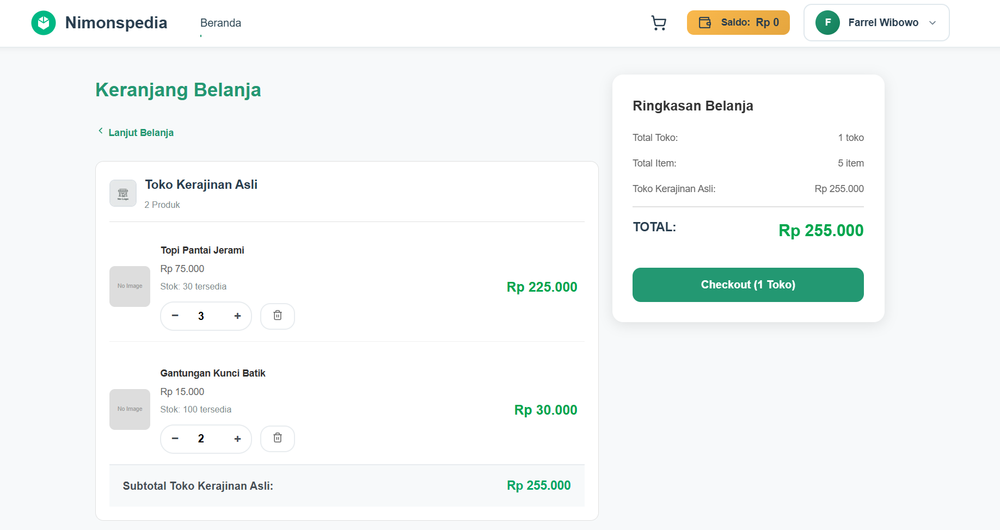
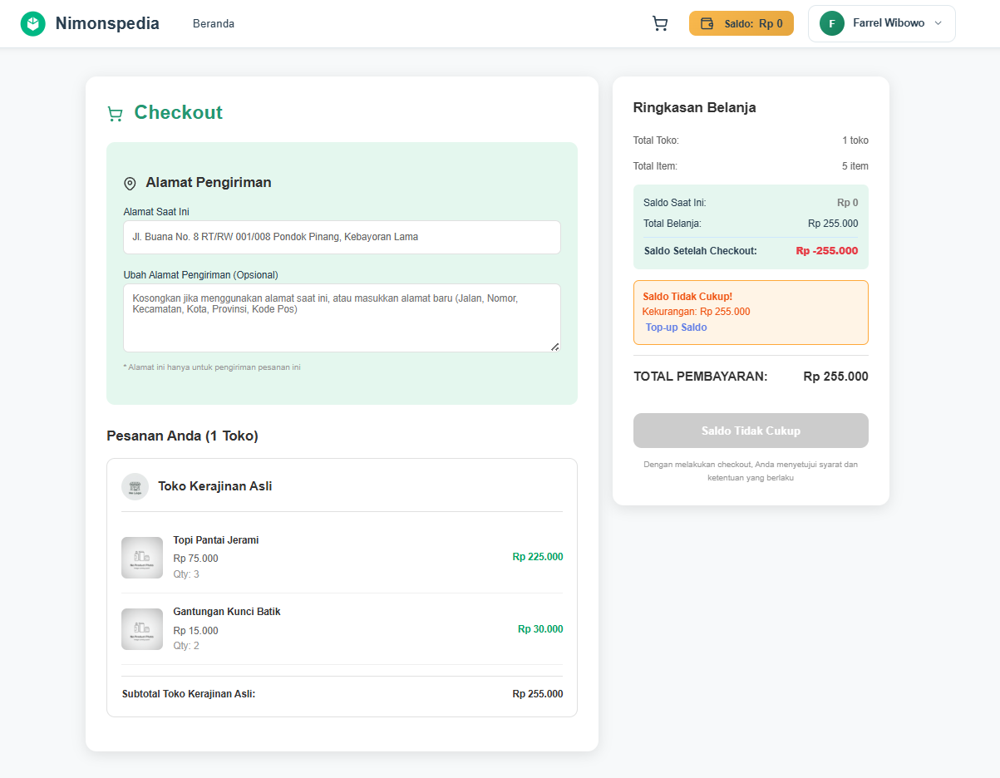
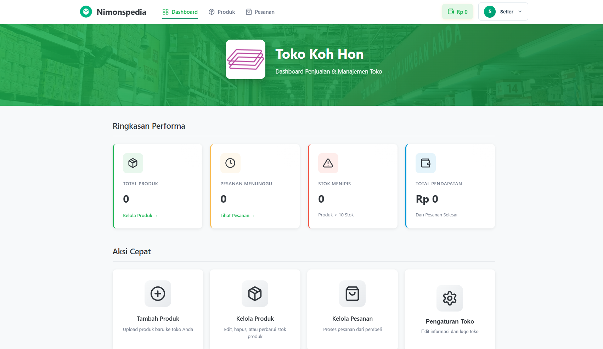
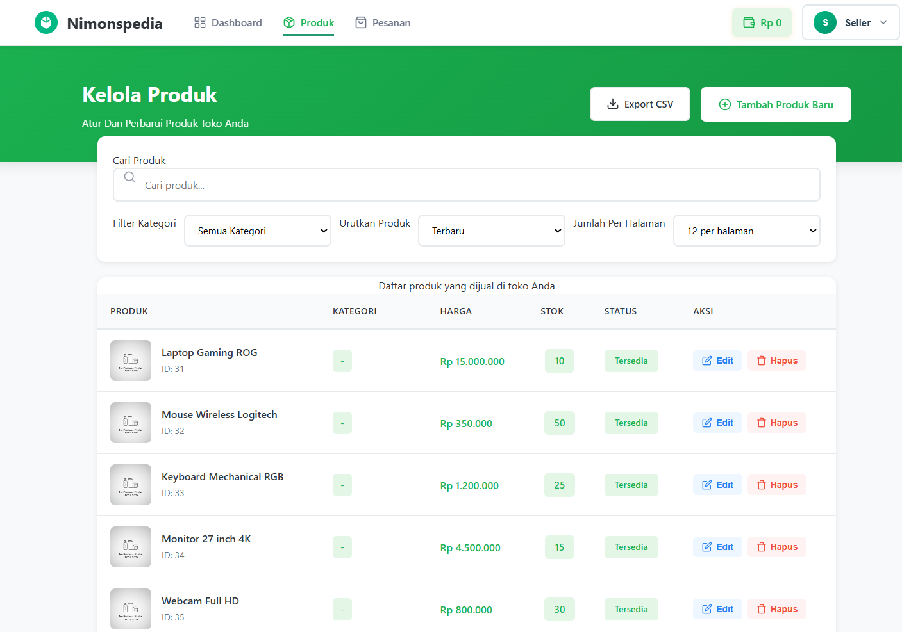
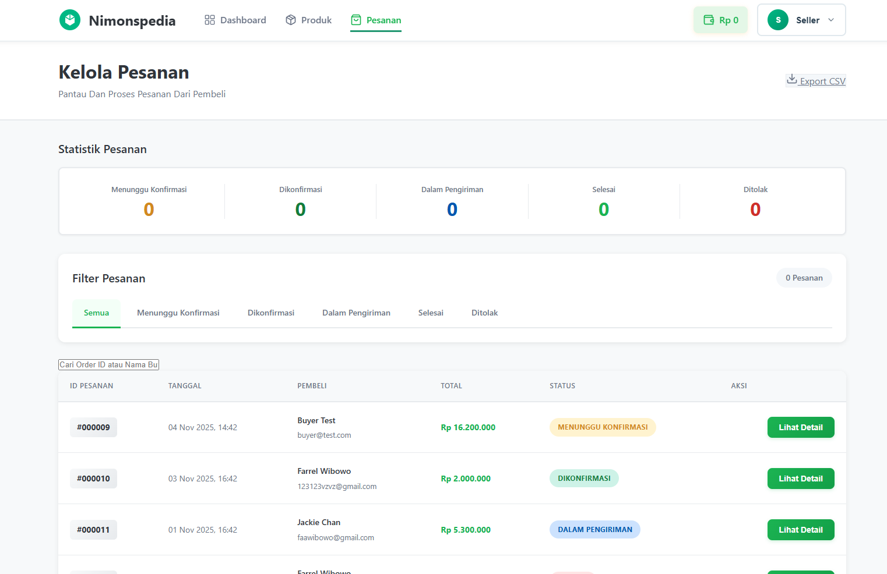
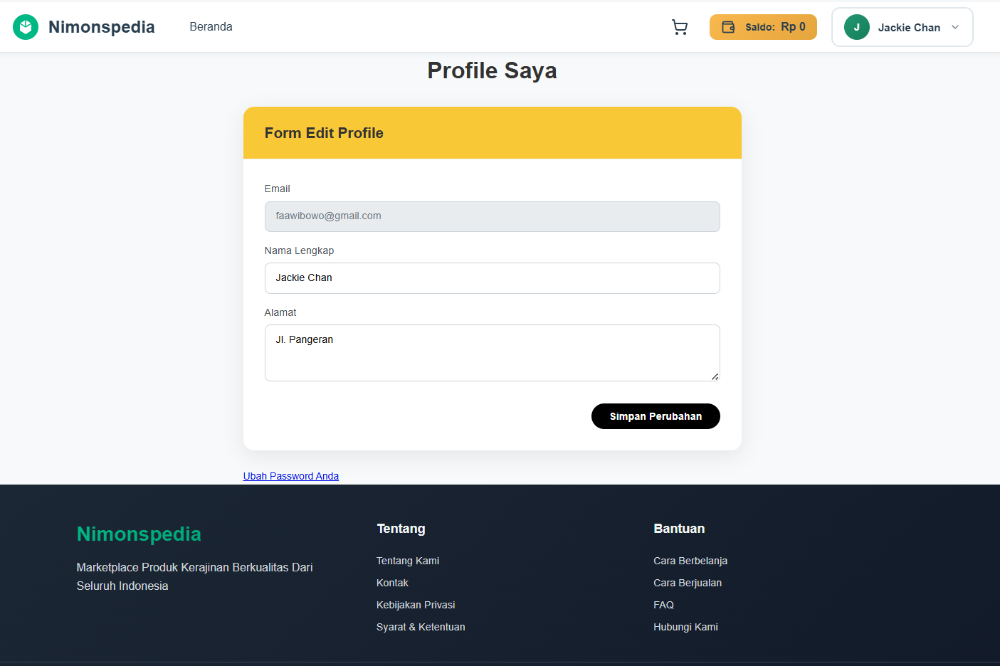

# Nimonspedia - E-Commerce Platform

## Deskripsi Aplikasi Web

Nimonspedia adalah platform e-commerce berbasis web yang memungkinkan pengguna untuk berbelanja produk dari berbagai seller dan memungkinkan seller untuk mengelola toko online mereka. Aplikasi ini dibangun menggunakan arsitektur MVC (Model-View-Controller) dengan PHP native dan PostgreSQL sebagai database.

### Fitur Utama:
- **Autentikasi**: Sistem login dan registrasi untuk Buyer dan Seller
- **Manajemen Produk**: Seller dapat menambah, mengedit, dan menghapus produk
- **Shopping Cart**: Buyer dapat menambahkan produk ke keranjang belanja
- **Checkout & Order**: Proses pembelian dan tracking pesanan
- **Manajemen Toko**: Seller dapat mengelola informasi toko dengan rich text editor (Quill)
- **Order Management**: Seller dapat melihat dan mengelola pesanan masuk
- **Balance Management**: Sistem saldo untuk transaksi
- **Product Discovery**: Pencarian dan filter produk berdasarkan kategori

## Daftar Requirement

### Software Requirements:
- Docker Desktop (versi terbaru)
- Docker Compose
- Git
- Web Browser (Chrome, Firefox, Edge, atau Safari)

### Technology Stack:
- **Backend**: PHP 8.1
- **Database**: PostgreSQL 15
- **Web Server**: Nginx (Alpine)
- **Containerization**: Docker & Docker Compose
- **Frontend**: HTML5, CSS3, JavaScript (Vanilla)
- **Rich Text Editor**: Quill.js 2.0.3

## Cara Instalasi

### 1. Clone Repository
```bash
git clone https://github.com/Labpro-22/milestone-1-tugas-besar-if-3110-web-based-development-k03-06.git
cd milestone-1-tugas-besar-if-3110-web-based-development-k03-06
```

### 2. Pastikan Docker Desktop Berjalan
Pastikan Docker Desktop sudah terinstall dan berjalan di komputer Anda.

### 3. Build dan Jalankan Container
```bash
docker-compose up -d --build
```

Perintah ini akan:
- Build Docker image untuk PHP
- Download image PostgreSQL dan Nginx
- Membuat dan menjalankan semua container
- Setup database secara otomatis

### 4. Setup Database (Jika belum otomatis)
Jika database belum ter-setup otomatis, jalankan:
```bash
docker exec -it nimonspedia-app php /var/www/html/database/setup.php
```

### 5. Verifikasi Instalasi
Buka browser dan akses: `http://localhost:8080/`

Jika berhasil, Anda akan melihat halaman home Nimonspedia.

## Cara Menjalankan Server

### Menjalankan Server
```bash
docker-compose up -d
```

### Menghentikan Server
```bash
docker-compose down
```
### Akses Database (PostgreSQL)
```bash
docker exec -it nimonspedia-db psql -U nimonspedia_user -d nimonspedia_db
```

## Tangkapan Layar Aplikasi

### 1. Halaman Home (Guest)

*Halaman utama dengan daftar produk dan kategori*

### 2. Halaman Login

*Form login untuk Buyer dan Seller*

### 3. Halaman Register

*Form registrasi dengan role selection (Buyer/Seller) dan Quill editor untuk deskripsi toko*

### 4. Halaman Product Discovery (Buyer)

*Halaman pencarian dan filter produk*

### 5. Halaman Product Detail

*Detail produk dengan opsi add to cart*

### 6. Halaman Shopping Cart

*Keranjang belanja dengan summary harga*

### 7. Halaman Checkout

*Proses checkout dan pembayaran*

### 8. Halaman Order History (Buyer)

*Riwayat pesanan buyer*

### 9. Halaman Seller Dashboard

*Dashboard seller dengan statistik toko*

### 10. Halaman Product Management (Seller)

*Manajemen produk seller*

### 11. Halaman Add/Edit Product (Seller)

*Form tambah/edit produk*

### 12. Halaman Order Management (Seller)

*Manajemen pesanan masuk seller*

### 13. Halaman Profile

*Halaman profil pengguna dan informasi saldo*


## Pembagian Tugas

### Server-side

#### Authentication & User Management
- **Login**: 13523156
- **Register**: 13523156
- **Logout**: 13523156
- **Profile Management**: 13523156, 13523136

#### Product Management
- **Product CRUD (Create, Read, Update, Delete)**: 13523156, 13523136
- **Product Discovery & Search**: 13523156, 13523136
- **Category Management**: 13523156

#### Shopping & Order
- **Shopping Cart**: 13523153
- **Checkout Process**: 13523153
- **Order Management (Buyer)**: 13523153
- **Order Management (Seller)**: 13523153

#### Store Management
- **Store CRUD**: 13523156
- **Store Dashboard**: 13523156
- **Balance Management**: 13523156

#### Core & Utilities
- **Router & MVC Setup**: 13523156
- **Database Setup & Migration**: 13523156
- **File Upload Service**: 13523156
- **CSRF Protection**: 13523156
- **Logger Service**: 13523156
- **Rate Limiting**: 13523156
- **Validation Services**: 13523156

### Client-side

#### Authentication Pages
- **Login Page (HTML/CSS/JS)**: 13523156
- **Register Page (HTML/CSS/JS)**:13523156
- **Register Page - Quill Integration**: 13523153

#### Buyer Pages
- **Home Page**: 13523156
- **Product Discovery Page**: 13523156
- **Product Detail Page**: 13523156
- **Shopping Cart Page**: 13523153
- **Checkout Page**: 13523153
- **Order History Page**: 13523153

#### Seller Pages
- **Seller Dashboard**: 13523136
- **Product Management Page**: 13523153, 13523136
- **Product Form (Add/Edit)**: 13523153, 13523136
- **Seller Orders Page**: 13523153, 13523136

#### Shared Components
- **Navbar (Guest/Buyer/Seller)**: 13523136, 13523156
- **Profile Page**: 13523156, 13523136
- **Base Styles**: 13523153, 13523156

## Team

**Kelompok K03-06**
- 13523156 - Hasri Fayadh Muqaffa
- 13523153 - Muhammad Farrel Wibowo
- 13523136 - Danendra Shafi Athallah 

**© 2025 Nimonspedia - IF3110 Web-Based Development K03-06**
