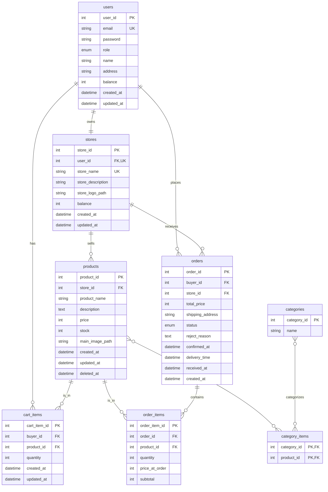

```mermaid    
    erDiagram
        users {
            int user_id PK
            string email UK
            string password
            enum role
            string name
            string address
            int balance
            datetime created_at
            datetime updated_at
        }
        stores {
            int store_id PK
            int user_id FK, UK
            string store_name UK
            string store_description
            string store_logo_path
            int balance
            datetime created_at
            datetime updated_at
        }
        products {
            int product_id PK
            int store_id FK
            string product_name
            text description
            int price
            int stock
            string main_image_path
            datetime created_at
            datetime updated_at
            datetime deleted_at
        }
        cart_items {
            int cart_item_id PK
            int buyer_id FK
            int product_id FK
            int quantity
            datetime created_at
            datetime updated_at
        }
        categories {
            int category_id PK
            string name
        }
        category_items {
            int category_id PK, FK
            int product_id PK, FK
        }
        orders {
            int order_id PK
            int buyer_id FK
            int store_id FK
            int total_price
            string shipping_address
            enum status
            text reject_reason
            datetime confirmed_at
            datetime delivery_time
            datetime received_at
            datetime created_at
        }
        order_items {
            int order_item_id PK
            int order_id FK
            int product_id FK
            int quantity
            int price_at_order
            int subtotal
        }

        users ||--|| stores : "owns"
        users ||--o{ cart_items : "has"
        users ||--o{ orders : "places"
        stores ||--o{ products : "sells"
        stores ||--o{ orders : "receives"
        products ||--o{ cart_items : "is_in"
        products ||--o{ order_items : "is_in"
        products }o--o{ category_items : "has"
        categories }o--o{ category_items : "categorizes"
        orders ||--o{ order_items : "contains"
```